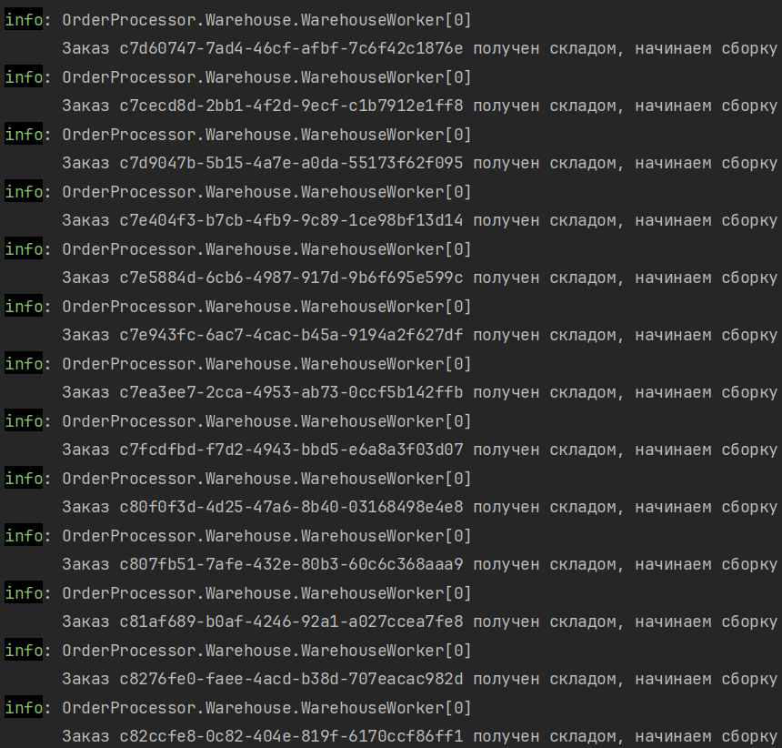
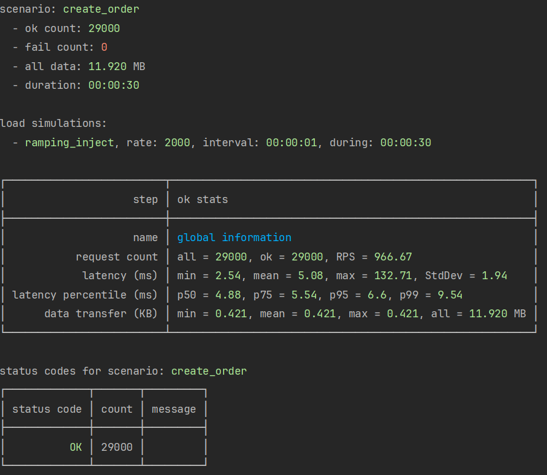

# OrderProcessor

Backend-сервис обработки заказов для маркетплейса: приём заказов через REST API,
асинхронная фоновая обработка и событийная интеграция со складом через Kafka.
Внутреннее межсервисное взаимодействие — по gRPC. Весь контур (API, PostgreSQL,
Kafka) поднимается одной командой в Docker.

## Стек

- **C# / .NET 8** — язык и платформа
- **PostgreSQL + EF Core** — хранилище, миграции, репозиторий + Unit of Work
- **Apache Kafka** — событийная шина (producer в API, consumer на складе)
- **gRPC** — внутреннее межсервисное взаимодействие (быстрый бинарный протокол)
- **Docker / docker compose** — контейнеризация всего контура (KRaft, без Zookeeper)
- **Testcontainers** — интеграционные тесты на реальном PostgreSQL
- **NBomber** — нагрузочное тестирование
- **OpenTelemetry** — метрики (HTTP + Kestrel) в консоль
- **Чистая архитектура** — Domain / Application / Infrastructure / API

## Архитектура

Проект разделён на слои по принципам чистой архитектуры. Все зависимости
направлены внутрь, к домену; `Domain` не зависит ни от чего.

### Зависимости между проектами

```
        API ─────────┐
         │           │
         ▼           ▼
   Application ◄── Infrastructure
         │           │
         ▼           │
      Domain ◄───────┘
         ▲
         │
       gRPC ──► Application ──► Domain
```

- `Domain` — сущности и инварианты (`Order`, `OrderItem`, правила смены статусов).
- `Application` — интерфейсы (`IOrderRepository`, `IUnitOfWork`, `IEventPublisher`), сервисы.
- `Infrastructure` — реализации: EF Core, репозиторий, Kafka-producer, фоновый воркер.
- `API` — REST-контроллеры + Swagger.
- `gRPC` — второй входной адаптер поверх того же `Application` («ещё одна дверь»).
- `Contracts` — стерильный проект с контрактами событий, без внешних зависимостей.
- `Warehouse` — отдельный сервис-consumer, читает события из Kafka.

### Поток обработки заказа (runtime)

```
Клиент
  │  POST /api/orders  (JSON: список items)
  ▼
[ API ] ──► сохранение заказа в PostgreSQL (статус Pending)
  │
  ▼
[ BackgroundWorker ]  раз в 5 сек:
  • находит заказы Pending
  • переводит Pending → Processing   (семафор №1: троттлинг обработки)
  • публикует событие в Kafka        (семафор №2: троттлинг публикации)
  │
  ▼  топик "order_created"  (тонкое событие: OrderId + время)
[ Kafka ]
  │
  ▼
[ Warehouse consumer ] ──► лог: "Заказ {Id} получен складом, начинаем сборку"
```

Событие `OrderCreatedEvent` намеренно тонкое — содержит только `OrderId` и время
создания, а не весь агрегат. Склад получает идентификатор и при необходимости
дотягивает детали сам, что держит событие лёгким и не дублирует состояние из БД.

Публикация событий изолирована от обработки: если Kafka недоступна, ошибка
логируется, но фоновый воркер и API продолжают работать.



## Запуск

Требуется установленный Docker.

```bash
docker compose up --build
```

Поднимутся три сервиса, связанные по DNS-именам внутри сети compose:

- **api** — REST API, Swagger на `http://localhost:8080/swagger`
- **postgres** — база данных (данные в volume, переживают перезапуск)
- **kafka** — брокер в режиме KRaft (два listener'а: `INTERNAL` для контейнеров,
  `EXTERNAL` для доступа с хост-машины)

Миграции применяются автоматически при старте API.

## Тестирование

### Интеграционный тест (Testcontainers)

Тест поднимает **реальный** PostgreSQL в Docker, применяет миграции, сохраняет
заказ через репозиторий и проверяет, что он появился в базе. Без моков.

Ключевые решения:
- Схема создаётся **через миграции** (`Database.MigrateAsync()`), а не
  `EnsureCreated()` — тест проходит тем же путём, что и прод.
- Проверка читается через **отдельный, свежий `DbContext`** — с пустым
  change tracker, что гарантирует чтение из базы, а не из кеша EF Core.

```bash
dotnet test
```

## Нагрузочное тестирование (NBomber)

Сценарий: `POST /api/orders`, ramping inject, rate 2000/сек, 30 секунд.

| Прогон | RPS (обработка) | Ошибки | p99 latency |
|--------|-----------------|--------|-------------|
| Холодный (без warm-up) | ~456 | ~37% (обрыв соединения) | ~11 мс |
| Прогретый | ~966 | 0 | единицы мс |

**Разбор потолка.** Первый прогон был по «холодному» рантайму (JIT ещё не
оптимизировал горячие пути, пулы соединений не раскачаны) — отсюда занижённый
RPS и отказы на установке соединения. Второй прогон, по прогретому сервису, —
достоверный.

Боттлнек — **не CPU**. Диагностика по трём признакам:
1. CPU контейнера в пике ~108% (≈ одно ядро, не насыщен) — устойчивой полки нет.
2. Latency успешных запросов — единицы мс, то есть обработка не тормозит.
3. Код ошибки — обрыв соединения (не `500`/`503`), то есть отказ на входе, а не
   внутри сервиса.

Вывод: сервис вычислительно недогружен, узкое место при резком наплыве — приём
одновременных соединений (лимиты Kestrel / ОС). Стабильно держит ~966 RPS на
локальном железе.



## Наблюдаемость (OpenTelemetry)

Метрики экспортируются в консоль (без Prometheus). Через авто-инструментацию
собираются без ручного кода:

- `http.server.request.duration` — длительность HTTP-запросов;
- `kestrel.active_connections`, `kestrel.queued_connections` — соединения
  (те самые метрики, что подсвечивают найденный нагрузочным тестом боттлнек);
- `http.server.active_requests` — активные запросы.

## Дальнейшие улучшения (осознанные TODO)

- **Outbox pattern** — устранить dual-write между БД и Kafka.
- **Идемпотентность consumer'а** — защита от повторной обработки события.
- **Healthcheck + `depends_on: condition: service_healthy`** — чтобы API ждал
  готовности Kafka/Postgres, а не только их старта.
- **Warm-up в нагрузочном тесте**; тюнинг лимитов Kestrel для более высокого RPS.
- **Семафоры на весь срок воркера** (сейчас пересоздаются каждую итерацию).
